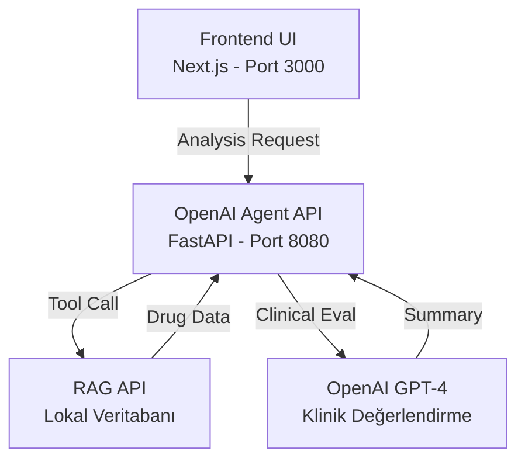

# Neuropharm: İlaç Etkileşim Analiz Sistemi

Neuropharm, OpenFDA veritabanını ve yapay zeka destekli klinik analiz motorunu kullanarak, hasta odaklı ilaç etkileşim analizleri sunan modern bir sağlık teknolojisi çözümüdür.

## 🌟 Temel Özellikler

### 1. Güvenilir Veri Kaynağı (OpenFDA)
- Doğrudan **FDA (Amerikan Gıda ve İlaç Dairesi)** veritabanı entegrasyonu.
- Statik veritabanı yerine her sorguda güncel veri.
- Kara kutu uyarıları, kontrendikasyonlar ve klinik veriler.

### 2. Hasta Odaklı Analiz (Anamnez)
- Sadece ilaç-ilaç etkileşimi değil, **hasta-ilaç** uyumu kontrolü.
- **Hastalık Çapraz Sorgusu:** Mevcut hastalıklar ile ilaç kontrendikasyonlarının eşleştirilmesi.
- **Özel Popülasyon Analizi:** Geriatrik (65+), Pediatrik ve Hamilelik durumlarına özel risk taraması.

### 3. Akıllı Klinik Motor
- **Yapılandırılmış Veri İşleme:** İlaç isimlerini standardize eder (örn. *Parol* -> *Acetaminophen*).
- **Ciddiyet Filtrelemesi:** Doktora sadece kritik (Critical) ve önemli (High) uyarıları sunar; bilgi kirliliğini önler.
- **AI Destekli Yorumlama:** Bulguları klinik bir eczacı yaklaşımıyla özetler ve aksiyon önerileri sunar.

---

## 🏛️ Mimari ve Teknik Detaylar

Bu sistem, ilaç etkileşim analizi için **üç katmanlı** bir mimari kullanır:



### Katmanlar
1.  **Veri Katmanı (OpenFDA):** OpenFDA API üzerinden gerçek zamanlı, onaylı ilaç verilerini sağlar.
2.  **Analiz Motoru (Backend - Python/FastAPI):**
    *   **Rule-Based Pre-processing:** Kurallı motor, veriyi tarar ve ön eleme yapar.
    *   **AI Clinical Agent:** Elenen veriyi bir klinik eczacı gibi yorumlar.
3.  **Sunum Katmanı (Frontend - Next.js):** Kullanıcı dostu web arayüzü.

---

## 🚀 Kurulum ve Çalıştırma

Proje Docker ile tek komutla ayağa kaldırılabilir.

### Gereksinimler
- Docker & Docker Compose
- OpenAI API Anahtarı

### Hızlı Başlangıç

1. **Projeyi Klonlayın**
   ```bash
   git clone https://github.com/egeaydin1/druginteraction.git
   cd druginteraction
   ```

2. **Ortam Değişkenlerini Ayarlayın**
   `.env` dosyasını oluşturun ve API anahtarınızı ekleyin:
   ```bash
   cp .env.example .env
   # .env dosyasını açın ve OPENAI_API_KEY değerini girin
   ```

3. **Uygulamayı Başlatın**
   ```bash
   docker-compose up -d --build
   ```

4. **Erişim**
   - **Frontend:** [http://localhost:3000](http://localhost:3000)
   - **Backend API:** [http://localhost:8080/docs](http://localhost:8080/docs)

---

## 📊 API Kullanımı

Sistemi kendi uygulamanıza entegre etmek için aşağıdaki endpoint'i kullanabilirsiniz.

### `POST /analyze`

**Örnek İstek (Request):**
```bash
curl -X POST http://localhost:8080/analyze \
  -H "Content-Type: application/json" \
  -d '{
    "age": 65,
    "gender": "female",
    "conditions": ["Diyabet", "Hipertansiyon"],
    "currentMedications": [
      {"id": "1", "name": "Metformin", "dosage": "850mg", "frequency": "2x1"},
      {"id": "2", "name": "Lisinopril", "dosage": "10mg", "frequency": "1x1"}
    ],
    "newMedications": [
      {"id": "3", "name": "Ibuprofen", "dosage": "400mg", "frequency": "3x1"}
    ]
  }'
```

**Örnek Yanıt (Response):**
```json
{
  "risk_score": 3,
  "results_found": true,
  "clinical_summary": "2 ilaç RAG veritabanında analiz edildi. ✅ DÜŞÜK RİSK...",
  "interaction_details": [
    {
      "drugs": ["Lisinopril", "Ibuprofen"],
      "severity": "Medium",
      "mechanism": "NSAID'ler ACE inhibitörlerinin antihipertansif etkisini azaltabilir."
    }
  ]
}
```

---

## 📄 Lisans

Bu proje **Apache License 2.0** ile lisanslanmıştır. Detaylar için [LICENSE](LICENSE) dosyasına bakınız.
