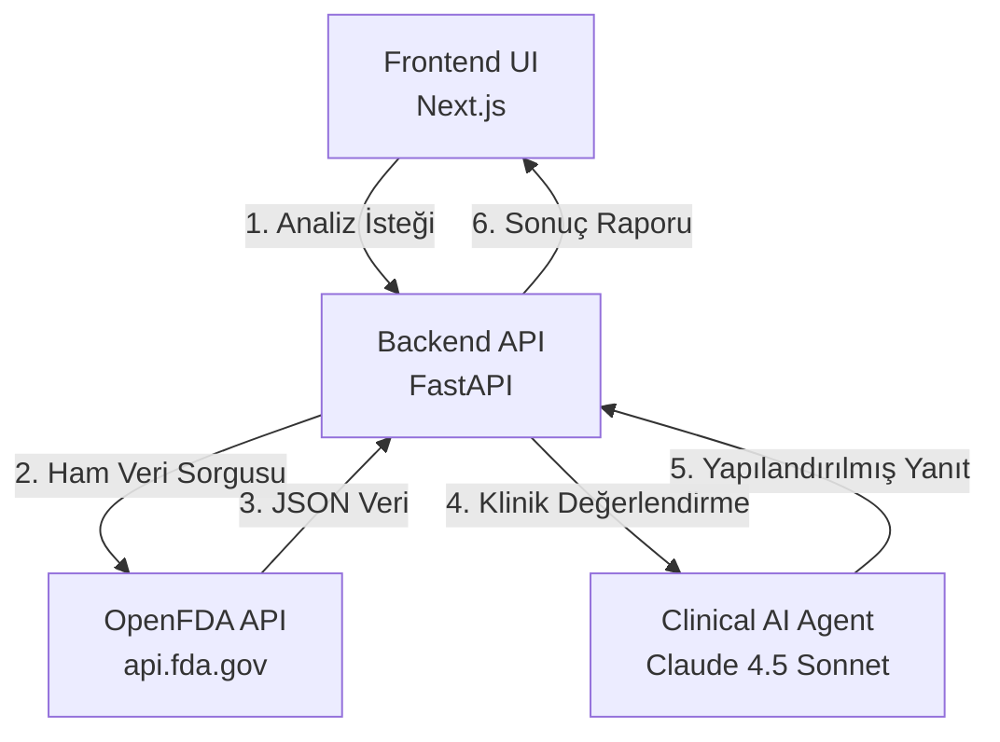

# Neuropharm: İlaç Etkileşim Analiz Sistemi

Neuropharm, OpenFDA veritabanını ve **Claude 4.5 Sonnet** (OpenRouter üzerinden) destekli klinik analiz motorunu kullanarak, hasta odaklı ilaç etkileşim analizleri sunan modern bir sağlık teknolojisi çözümüdür.

## 🌟 Temel Özellikler

### 1. Güvenilir Veri Kaynağı (OpenFDA - Real-time)
- **Doğrudan Entegrasyon:** Sistem, statik bir veritabanı yerine, her sorguda doğrudan **fda.gov** API'lerine bağlanarak en güncel veriyi çeker.
- **Canlı Veri:** İlaç etiketleri, güncel kara kutu uyarıları ve kontrendikasyonlar anlık olarak sorgulanır.
- **RAG Yok, Gecikme Yok:** Vektör veritabanı veya ara katman kullanılmaz; ham veri doğrudan kaynağından alınır.

### 2. Klinik AI Ajanı (Claude 4.5 Sonnet)
- **Model:** OpenRouter API üzerinden **Anthropic Claude 4.5 Sonnet** modeli kullanılır.
- **Rolü:** OpenFDA'dan çekilen ham ve karmaşık klinik veriyi (json formatında), bir klinik eczacı bakış açısıyla analiz eder, özetler ve Türkçeleştirir.
- **Yeteneği:** Sadece veri listelemez; hastanın yaşına, cinsiyetine ve hastalıklarına göre risk değerlendirmesi yapar.

### 3. Hasta Odaklı Analiz (Anamnez)
- Sadece ilaç-ilaç etkileşimi değil, **hasta-ilaç** uyumu kontrolü.
- **Hastalık Çapraz Sorgusu:** Mevcut hastalıklar ile ilaç kontrendikasyonlarının eşleştirilmesi.
- **Özel Popülasyon Analizi:** Geriatrik (65+), Pediatrik ve Hamilelik durumlarına özel risk taraması.

---

## 🏛️ Sistem Mimarisi

Sistem, doğrudan veri akışına dayalı **yalın ve hibrit** bir mimari kullanır:



### Akış Detayı
1.  **Veri Toplama:** Backend, ilaç isimlerini OpenFDA API'de arar ve ilgili etiket bilgilerini (uyarılar, etkileşimler, dozaj) çeker.
2.  **AI Analizi:** Toplanan ham veri, özel bir sistem promptu ile Claude 4.5 Sonnet modeline gönderilir. "Bu hasta profili için bu verileri değerlendir" komutu verilir.
3.  **Sonuç:** AI, tıbbi terminolojiyi hastanın anlayabileceği (ve doktorun hızlıca tarayabileceği) yapılandırılmış bir JSON formatına dönüştürür.

---

## 🚀 Kurulum ve Çalıştırma

Proje Docker ile tek komutla ayağa kaldırılabilir.

### Gereksinimler
- Docker & Docker Compose
- OpenRouter API Anahtarı (Claude 4.5 Sonnet erişimi için)

### Hızlı Başlangıç

1. **Projeyi Klonlayın**
   ```bash
   git clone https://github.com/egeaydin1/druginteraction.git
   cd druginteraction
   ```

2. **Ortam Değişkenlerini Ayarlayın**
   `.env` dosyasını oluşturun ve API anahtarınızı ekleyin:
   ```bash
   cp .env.example .env
   # .env dosyasını açın:
   # OPEN_ROUTER_API_KEY=sk-or-v1-xxxxxxxx...
   ```

3. **Uygulamayı Başlatın**
   ```bash
   docker-compose up -d --build
   ```

4. **Erişim**
   - **Frontend:** [http://localhost:3000](http://localhost:3000)
   - **Backend API:** [http://localhost:8080/docs](http://localhost:8080/docs)

---

## 📊 API Kullanımı

Sistemi kendi uygulamanıza entegre etmek için aşağıdaki endpoint'i kullanabilirsiniz.

### `POST /analyze`

**Örnek İstek (Request):**
```bash
curl -X POST http://localhost:8080/analyze \
  -H "Content-Type: application/json" \
  -d '{
    "age": 65,
    "gender": "male",
    "conditions": ["Hipertansiyon"],
    "currentMedications": [
      {"id": "1", "name": "Lisinopril", "dosage": "10mg"}
    ],
    "newMedications": [
      {"id": "2", "name": "Ibuprofen", "dosage": "400mg"}
    ]
  }'
```

**Örnek Yanıt (Response):**
```json
{
  "risk_score": 6,
  "results_found": true,
  "clinical_summary": "Lisinopril ve Ibuprofen birlikte kullanıldığında böbrek fonksiyonlarında bozulma riski artabilir...",
  "interaction_details": [
    {
      "drugs": ["Lisinopril", "Ibuprofen"],
      "severity": "Medium",
      "mechanism": "NSAID'ler ACE inhibitörlerinin etkisini azaltabilir ve potasyum seviyesini yükseltebilir."
    }
  ]
}
```

---

## 📄 Lisans

Bu proje **Apache License 2.0** ile lisanslanmıştır. Detaylar için [LICENSE](LICENSE) dosyasına bakınız.
